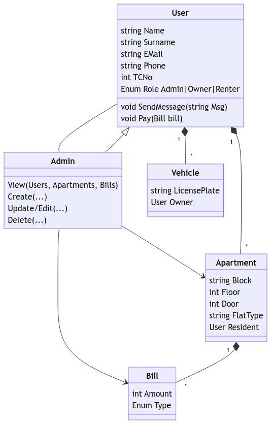

# FOPatika-SoftwareAcademy-FinalProject

Final project of FO Patika Software Academy Program



## Usage

1- If you want to review my repository locally, please clone it first.

```
git clone https://github.com/dorukolcmener/FOPatika-SoftwareAcademy-FinalProject
```

2- After downloading the repository, open it with your favourite IDE.

```
cd FOPatika-SoftwareAcademy-FinalProject
code .
```

3- Initialize migration

```
dotnet ef migrations add Initial
```

4- Connect and update database with the migration

```
dotnet ef database update.
```

5- Run the application

```
dotnet run
dotnet watch run
```

6- Login as Admin (Please change your password once you have logged in.)

```
E-Mail: avatar.korra@test.com
Password: test123
```

## Next Steps (Pending)

- Restructure and implement fluent validation for controllers.

Enjoy 🚀 - Doruk

## Communication channels:

<a href="https://www.linkedin.com/in/dorukolcmener/"></a> &emsp;
<a href="https://discord.com/users/772126247685718036" target="_blank">

</a> &emsp;
<a href="https://app.patika.dev/kaolin"></a> &emsp;
<a href="https://lichess.org/@/dorukovic"></a>

## Contributing

Pull requests are welcome. Please start a discussion before raising major changes. Thank you 😊.

## License

[MIT](LICENSE)
